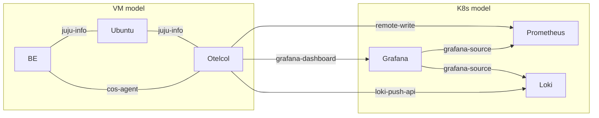

# Blackbox Exporter Operator For Machines
[](https://charmhub.io/blackbox-exporter)
[](https://github.com/canonical/blackbox-exporter-operator/actions/workflows/release.yaml)

This charm operates the Prometheus Blackbox Exporter on bare metal, VMs, machines, LXD, etc. It complements the [Blackbox Exporter Operator K8s charm](https://charmhub.io/blackbox-exporter-k8s).
Prometheus Blackbox Exporter is a monitoring tool that probes external endpoints over protocols like HTTP, HTTPS, DNS, TCP, ICMP, and gRPC to assess their availability, performance, and health from an external perspective.

## What does this charm do?
As an operator for Blackbox Exporter on Juju, this charm automates the lifecycle and provides some functionalities out of the box. This charm is a subordinate charm - that means, it needs to be related to a principal charm and it will scale up and down along with that principal charm. Also, for the purpose of scraping `probe_success` metrics, it's required that there is an Opentelemetry Collector machine charm on every machine with a Blackbox Exporter unit and the BE and Opentelemetry Collector units are related.

> Note that instead of Opentelemetry Collector, you may also use Grafana Agent or any other charm that implements the `CosAgentConsumer` class. 

This charm offers:
<!--  TODO: If and when a `automatic_connectivity_checks` config option is added, update (1) to mention that the auto connectivity check behaviour is controlled by that option. -->
1. Automatic cross-unit connectivity checks between all machines hosting a Blackbox Exporter unit. Each unit of Blackbox Exporter attempts to test its connectivity to _all_ of its peers over _all_ networks. For this reason, each unit creates Prometheus-compatible scrape jobs where the targets are the addresses of all of the other BE units across different network interfaces. This option relies on the `ICMP` module to perform these checks.
2. A `probes_file` config option which allows an admin to provide their own Prometheus-compatible scrape jobs. The charm will then forward these scrape jobs over the `cos_agent` interface to the charm scraping it e.g. Opentelemetry Collector.
3. A `config_file` config option which allows an admin to specify their desired probing modules and parameters in YAML format. By default, this charm uses the following modules which should meet most probing needs. If at any point more complex probes are needed, they can be supplied through this option. Upon providing a value, basic validation will be performed and the charm will be set to `Blocked` if the config is deemed invalid.
```yaml
modules:
    http_2xx:
        prober: http
        timeout: 10s
    tcp_connect:
        prober: tcp
        timeout: 10s
    icmp:
        prober: icmp
        timeout: 10s
        icmp:
            preferred_ip_protocol: "ip4"
            ip_protocol_fallback: true
```

# What does a sample deployment look like?
The exercise below walks you through what a typical set up for this charm looks like. Ensure you have Juju installed and bootstrap a LXD cloud. The goal of the exercise is to see how Blackbox Exporter can perform automatic cross-unit connectivity checks, accept custom probe scrape jobs, integrate with the rest of the COS/COS Lite solution, provide dashboars, etc.
To start, deploy the following bundle.

```yaml
default-base: ubuntu@24.04/stable
applications:
  be:
    charm: local:blackbox-exporter-operator-0
  otel:
    charm: opentelemetry-collector
    channel: 2/edge
    revision: 148
  ubuntu:
    charm: ubuntu
    channel: latest/stable
    revision: 26
    num_units: 2
    to:
    - "0"
    - "1"
    constraints: arch=amd64
    storage:
      block: loop,100M
      files: rootfs,100M
machines:
  "0":
    constraints: arch=amd64
  "1":
    constraints: arch=amd64
relations:
- - ubuntu:juju-info
  - be:juju-info
- - ubuntu:juju-info
  - otel:juju-info
- - otel:cos-agent
  - be:cos-agent

```
Now, you can use the `probes_file` config option to provide some custom targets you are interested in probing.
Do
```bash
juju config be probes_file=@probes.yaml
```
where `probes.yaml` is:
```
scrape_configs:
  - job_name: blackbox-http
    metrics_path: /probe
    params:
      module: [http_2xx]
    static_configs:
      - targets:
          - charmhub.io
          - ubuntu.com
```
> Note: when providing custom scrape jobs, you do not need to specify the `relabel_configs` section. The charm automatically enhances the custom jobs with this information.

## Pushing `probe_success` metrics to a backend
Assuming you have Prometheus deployed in a K8s model, you will need to create an offer. 
For example, do
```bash
juju offer prometheus:receive-remote-write
```
In your LXD model containing the deployment above, do
```bash
juju consume <k8s-controller-name>:admin/<cos-lite-model-name>.prometheus
```
and 
```bash
juju integrate otel prometheus
```
Now Opentelemetry Collector will remote write the time-series containing the probe results into Prometheus.

## Dashboards
This charm comes with a dashboard which provides a comprehensive view and summary of probe results, among other metrics. For this to work, you need to ensure you have the [Grafana K8s](https://charmhub.io/grafana-k8s) charms deployed inside your K8s model.
Create an offer for Grafana to receive dashboards from Opentelemetry Collector.
```bash
juju offer graf:grafana-dashboard
```
Now, relate Opentelemetry Collector to Grafana.
```bash
juju integrate otel grafana
```
For dashboards to display all necessary data, ensure both Prometheus or Loki are datasources for Grafana. For this purpose, do
```bash
juju integrate loki grafana:grafana-source
juju integrate prometheus grafana:grafana-source
```

## Logs
Opentelemetry Collector is capable of gathering logs by the `prometheus-blackbox-exporter` snap (managed by this snap), and forwarding them to Loki. 
Create an offer for Loki to receive logs from Opentelemetry Collector.
```bash
juju offer loki:logging
```
Now, relate Opentelemetry Collector to Grafana.
```bash
juju integrate otel loki
```

The end deployment should look something like:


